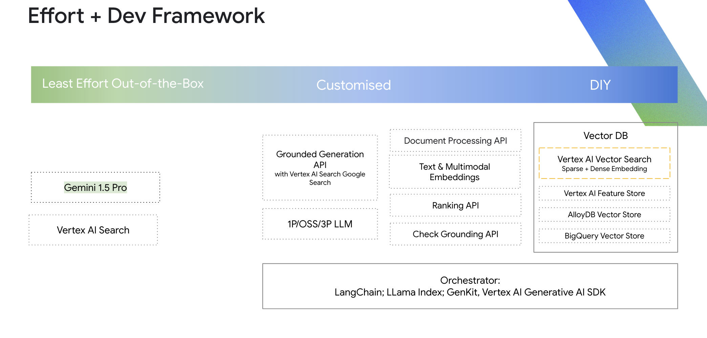

# Generative AI - Vertex AI Search

Welcome to the Google Cloud [Generative AI](https://cloud.google.com/ai/generative-ai/) - Vertex AI Search repository.

Google Cloud Vertex AI is Powering the Future of Search. Google Cloud Vertex AI offers a comprehensive suite of tools and services to address the above search patterns.

Building and managing RAG systems can be complex and can be quite nuanced. Developers need to develop and maintain several RAG building blocks like data connectors, data processing, chunking, vectorization with embeddings, indexing, retrieval, reranking, along with LLM-powered summarization which can be time and resource intensive. Being able to scale each of the components to handle bursty search traffic and coping with a large corpus of varied and frequently updated data can be challenging.  

[Vertex AI Search](https://cloud.google.com/generative-ai-app-builder/docs/enterprise-search-introduction) leverages decades of Google's expertise in information retrieval and brings together the power of deep information retrieval, state-of-the-art natural language processing, and the latest in large language model (LLM) processing to understand user intent and return the most relevant results for the user. Based on where you are in the development journey, Vertex AI Search provides a varied options from out-of-the-box (OOTB) to DIY APIs to bring RAG to life. 

### Why Vertex AI Search OOTB: 

- The out-of-the-box solution can bring Google-Quality search to build end to end state-of-the-art semantic and hybrid search applications. 
- It has in-built connectors to several data sources (Cloud Storage, BigQuery, Websites, Confluence, JIRA, Salesforce, Slack and many more). 
- It can leverage layout information to parsing  tables, paragraphs, headings and other elements  in documents and chunk it more effectively. 
- It uses a combination of keyword (sparse) and LLM (dense) based embeddings to be able to handle varied user queries better. Sparse vectors tend to directly map words to numbers and dense vectors are designed to better represent the meaning of a piece of text. 
- It leverages advanced [neural matching](https://blog.google/products/search/improving-search-next-20-years/) between user queries and document snippets to retrieve highly relevant and ranked results for the user. Neural matching allows a retrieval engine to learn the relationships between intention of a query and highly relevant documents, allowing Search to recognize the context of a query instead of the simple similarity search. 
- It provides users with LLM powered summaries with citations and is designed to scale to your search traffic. Vertex AI Search now also supports custom instruction templates, making it easy to create powerful competent search experiences with minimal effort. Developers can leverage the console / SDK to quickly leverage and test the OOTB agent.

Explore [Part 1 of this notebook example](vertex-search-options/vertex_search_ootb_customize.ipynb) to see how to leverage the Vertex AI Agent Builder SDK to start building your search application.

### For greater customization 
Vertex AI Search SDK further allows developers to integrate Vertex AI Search with open-source LLMs or other custom components, tailoring the search pipeline to their specific needs. As mentioned above, building end to end RAG solutions can be complex, developers might want to rely on Vertex AI Search as a grounding source for search results retrieval and ranking, and leverage custom LLM for the guided summary.   Vertex AI Search also provides grounding in Google Search and 3P commercial datasets e.g. Bloomberg market data, TR legal documents, D&B company business information.

Find an example for using Vertex AI Search to Ground Responses for Gemini mode in [Part 2 of this example notebook here](vertex-search-options/vertex_search_ootb_customize.ipynb).

Developers might already be leveraging frameworks like LangChain/ LLamaIndex for orchestration of their LLM application and would want to use Vertex AI Search for information retrieval. Vertex AI Search  has native integration with LangChain or can be enabled as an available tool in Vertex AI Gemini SDK to generate custom grounded responses providing developers with varied choice to build their RAG solutions

[Part 3 of this notebook example](vertex-search-options/vertex_search_ootb_customize.ipynb) for leveraging Vertex AI Search from LangChain here.

Vertex AI provides the essential building blocks for developers who want to construct their own end-to-end RAG solutions with full flexibility. These include APIs for document parsing, chunking, LLM text and multimodal vector embeddings, versatile vector database options (Vertex AI Vector Search, AlloyDB, BigQuery Vector DB), reranking APIs, and grounding checks.

Learn more about the Build your own RAG workflow with DIY APIs [here](https://cloud.google.com/generative-ai-app-builder/docs/builder-apis#build-rag). Find [this  example repo](https://github.com/GoogleCloudPlatform/applied-ai-engineering-samples/blob/main/genai-on-vertex-ai/retrieval_augmented_generation/diy_rag_with_vertexai_apis/build_grounded_rag_app_with_vertex.ipynb) for bringing your DIY e2e RAG workflows to live with Vertex AI DIY APIs. 

It is also worth noting that [Gemini 1.5 pro](https://cloud.google.com/vertex-ai/generative-ai/docs/learn/models#gemini-1.5-pro) available on Vertex AI supports a 2M token input context window, around 2000 pages worth of context, while maintaining [SOTA reasoning capabilities](https://deepmind.google/technologies/gemini/pro/?_gl=1*128a4ox*_up*MQ..*_ga*MTgzMDgwODIxNC4xNzE5OTU2NjIw*_ga_LS8HVHCNQ0*MTcxOTk1NjYyMC4xLjAuMTcxOTk1NjYyMC4wLjAuMA..). Recently Google Deepmind and Uni of Michigan published a comprehensive research on [RAG or Long Context window](https://arxiv.org/html/2407.16833v1). Gemini 1.5 Pro can reason with user input query, available Prompt System Instructions, the given context and respond to user queries. With the long context window clubbed with multimodal reasoning, caching ability, developers can quickly start with Gemini 1.5 pro to quickly test and prototype their semantic information retrieval use case. 

Based on where Developers are in their journey, their orchestration framework of choice,  they can select Vertex AI Search OOTB capabilities or customize their search solutions with Vertex AI Search Retrievers or use the Vertex AI DIY APIs to build the end to end RAG application. Understanding your organization’s appetite towards building, maintaining and scaling RAG applications can also help guide a particular solution path. 

## Table of Contents

<!-- markdownlint-disable MD033 -->
<pre>
search/

├── <a href="vertex-search-options"> Vertex AI Search OOTB to Customize with LangChain/Grounding Service </a>
├── <a href="retrieval-augmented-generation">retrieval-augmented-generation/</a>
│   └──  <a href="retrieval-augmented-generation/examples/question_answering.ipynb">[Notebook] Question Answering Over Documents with Vertex AI Search and LangChain 🦜🔗</a>
└── <a href="web-app">web-app/</a>
    └──  <a href="web-app">[Demo] Vertex AI Search Web Application</a>
</pre>
